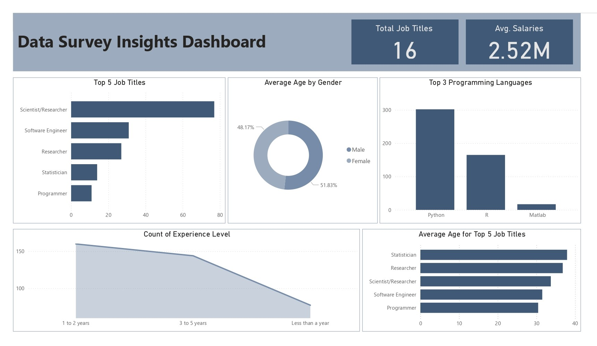

# Kaggle Data Science Survey 2017 Analysis

## Overview
This project analyzes the Kaggle Data Science Survey 2017 dataset, focusing on deriving insights from data science professionals' responses. Conducted as of August 05, 2025, it showcases trends in demographics, programming languages, job titles, and experience levels.

## Description
The analysis involves cleaning the `multipleChoiceResponses.csv` file, performing data transformations, and generating insights such as the top 5 programming languages, age distributions by job title, and employment trends. These insights are visualized in an interactive Power BI dashboard.

## Dashboard
The Power BI dashboard presents the cleaned data and key insights interactively. Below is a picture of the dashboard:

## Tools & Technologies
- **Python**: Used for data cleaning and analysis with libraries like pandas, matplotlib, and kagglehub.
- **Power BI**: Employed to create the interactive dashboard visualizing the insights.

## Dataset
- **Source**: [Kaggle Survey 2017](https://www.kaggle.com/datasets/kaggle/kaggle-survey-2017)
- **File**: `multipleChoiceResponses.csv`
- **Content**: Captures responses from data science professionals on demographics, preferred programming languages, job titles, experience levels, and more, offering a snapshot of the field's overview from 2017.

## Installation
1. Download the `multipleChoiceResponses.csv` file from the Kaggle dataset link.
2. Install the required Python packages using the `requirements.txt` file (see below).
3. (Optional) Run any provided Python scripts to replicate the analysis.
4. Open the Power BI file (if shared) or import the CSV into Power BI to recreate the dashboard.

## Requirements
To replicate the analysis, install the following Python packages listed in `requirements.txt`:
- `pandas==2.0.3`
- `matplotlib==3.7.1`
- `kagglehub==0.2.3`

Run `pip install -r requirements.txt` in your terminal or command prompt after creating the file with the above dependencies.
